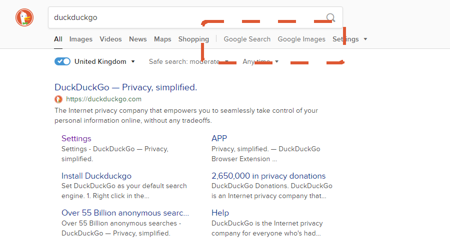

 A convenient visual method for searching with Google from DuckDuckGo.com

## About
| |
|:---:|
|  |
| This extension creates additional UI within DuckDuckGo toolbar, making it easier to view the same search in Google / Google Images. |

DuckDuckGo is an excellent search tool, however it lacks in certain areas compared to Google Search. While it's regular page results are often acceptable, it is sometimes useful to make use of Google's advanced indexing. 

This chrome extension adds two additional buttons to the 'duckbar', which  link to the Google Search and Google Images results for a given query. 

## Installation
1. Clone this repository onto your device.
2. Navigate to `chrome://extensions/` (replace `chrome` with the name of your Chromium based browser, for instance `opera://extensions/`).
3. Open the file explorer using `Load unpacked` and navigate to the root folder of this repository. 
4. Select this folder, and the extension should load into your list of browser extensions.

### Troubleshooting
If you use DuckDuckGo as your default search engine, you may have to grant permission for the extension to view search page results.

1. Navigate to `chrome://extensions` as before.
2. From the extension card, navigate to permission settings using the `details` button.
3. Enable the `Allow access to search page results` setting. This will enable the extension to run when searching with DuckDuckGo using the omni-search-bar.

## License
MIT